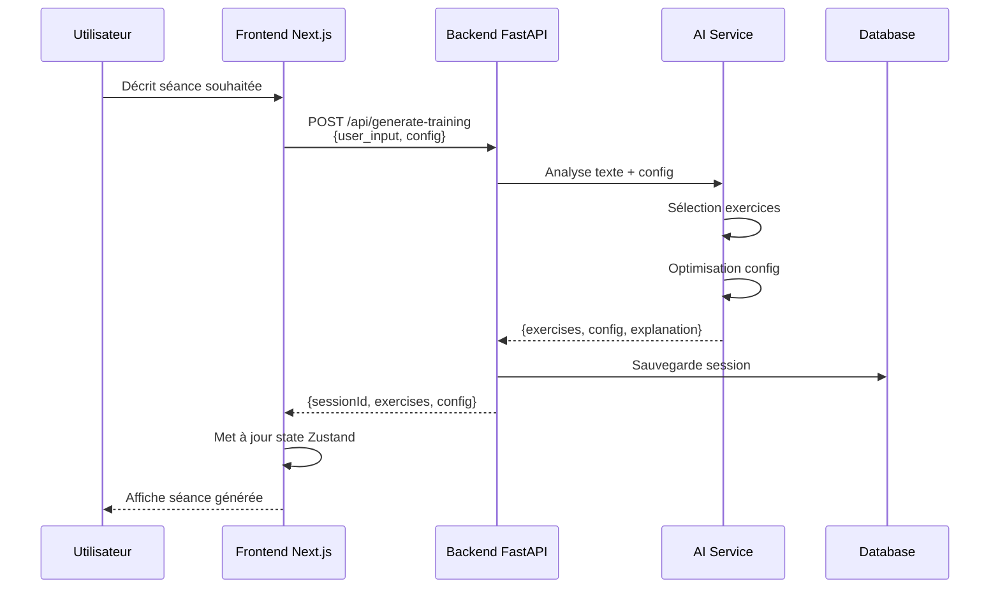
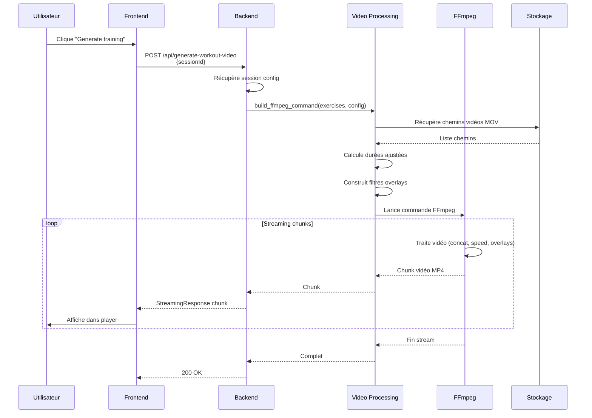

# Architecture globale du SaaS Virtual AI Coach

## Vue d'ensemble

Le SaaS Virtual AI Coach est une application de coaching sportif permettant de générer et diffuser des séances d'entraînement vidéo personnalisées à la volée, en combinant des vidéos unitaires d'exercices avec des overlays et personnalisations.

## Architecture système

```
┌─────────────────────────────────────────────────────────────────┐
│                         UTILISATEUR                              │
└────────────────────────────┬────────────────────────────────────┘
                             │
                             ▼
┌─────────────────────────────────────────────────────────────────┐
│                   FRONTEND - Next.js 14+                         │
│  Déployé sur : Vercel (Free Tier)                               │
│                                                                  │
│  ┌────────────────┐  ┌────────────────┐  ┌──────────────────┐ │
│  │ Page Train     │  │ Video Player   │  │ AI Assistant     │ │
│  │ - Selection    │  │ - Streaming    │  │ - Génération IA  │ │
│  │ - Config       │  │ - Overlays     │  │ - Suggestions    │ │
│  └────────────────┘  └────────────────┘  └──────────────────┘ │
│                                                                  │
│  State: Zustand Store                                           │
│  UI: Tailwind CSS + Shadcn/ui                                   │
└────────────────────────┬────────────────────────────────────────┘
                         │ HTTP/REST API
                         │ WebSocket (optionnel pour updates temps réel)
                         ▼
┌─────────────────────────────────────────────────────────────────┐
│              BACKEND - Python 3.11+ / FastAPI                    │
│  Déployé sur : Railway/Render (Free → 5-10€/mois)              │
│                                                                  │
│  ┌──────────────────────────────────────────────────────────┐  │
│  │                    API Layer                              │  │
│  │  - POST /api/generate-training (IA)                       │  │
│  │  - POST /api/generate-workout-video (streaming)           │  │
│  │  - GET  /api/exercises                                    │  │
│  │  - GET  /api/workouts/{id}                                │  │
│  └──────────────────────┬───────────────────────────────────┘  │
│                         │                                        │
│  ┌──────────────────────▼───────────────────────────────────┐  │
│  │              Video Processing Service                     │  │
│  │  - Génération séquence FFmpeg                             │  │
│  │  - Gestion overlays (timer, progress, texte)              │  │
│  │  - Calcul durées et vitesses selon intensité              │  │
│  │  - Streaming HTTP chunks                                  │  │
│  └──────────────────────┬───────────────────────────────────┘  │
│                         │                                        │
│  ┌──────────────────────▼───────────────────────────────────┐  │
│  │                 AI Generation Service                     │  │
│  │  - Analyse requête utilisateur                            │  │
│  │  - Sélection exercices pertinents                         │  │
│  │  - Génération configuration optimale                      │  │
│  │  - LLM: OpenAI GPT-4o-mini ou Anthropic Claude           │  │
│  └──────────────────────┬───────────────────────────────────┘  │
│                         │                                        │
└─────────────────────────┼────────────────────────────────────────┘
                          │
                          ▼
         ┌────────────────────────────────────┐
         │         FFmpeg Process             │
         │  - Concaténation vidéos            │
         │  - Filtres complexes               │
         │  - Codec H.264 pour sortie         │
         │  - Streaming stdout                │
         └────────────┬───────────────────────┘
                      │
                      ▼
┌─────────────────────────────────────────────────────────────────┐
│                    STOCKAGE VIDÉOS                               │
│                                                                  │
│  Phase MVP (local):                                             │
│  └─ exercices_generation/outputs/                               │
│     ├─ pushups/push_ups_female/output_video_transparent.mov     │
│     ├─ air_squat/...                                            │
│     └─ quick_feet_half_burpee/...                               │
│                                                                  │
│  Phase Production:                                              │
│  └─ Supabase Storage (Free 1GB → Pro 100GB)                    │
│     ├─ CDN intégré pour delivery                                │
│     └─ URLs signées pour sécurité                               │
└─────────────────────────────────────────────────────────────────┘
```

## Flux de données détaillé

### 1. Génération de séance avec assistant IA



### 2. Génération et streaming vidéo



## Schéma de données

Le schéma de données complet, les tables PostgreSQL, les index et les stratégies de cache sont documentés dans [`database_strategy.md`](docs/database_strategy.md:1).

**Résumé des entités principales :**
- **Exercices** : Catalogue des exercices avec métadonnées (vidéo, difficulté, catégories)
- **Workouts** : Sessions d'entraînement configurées par l'utilisateur
- **Users** : Profils utilisateurs et préférences (avec Supabase Auth)
- **Relations** : Many-to-many entre exercices et catégories, exercices et workouts

Voir [`database_strategy.md`](docs/database_strategy.md:1) pour les détails complets du schéma SQL.

## Stack technique détaillée

### Frontend

| Composant | Technologie | Raison |
|-----------|-------------|--------|
| Framework | Next.js 14+ (App Router) | SSR, optimisation auto, écosystème |
| Langage | TypeScript | Type safety, meilleure DX |
| Styling | Tailwind CSS + Shadcn/ui | Rapidité, composants prêts |
| State | Zustand | Simple, performant, devtools |
| Data fetching | TanStack Query | Cache, retry, optimistic updates |
| Video player | React Player ou HTML5 | Contrôle fin, overlays custom |
| Drag & Drop | @dnd-kit | Moderne, accessible |
| Animations | Framer Motion | Fluide, performant |
| Déploiement | Vercel Free Tier | 0€, CI/CD auto, edge functions |

### Backend

| Composant | Technologie | Raison |
|-----------|-------------|--------|
| Framework | FastAPI | Async, performant, docs auto |
| Langage | Python 3.11+ | Cohérence avec code existant |
| Vidéo | FFmpeg + ffmpeg-python | Standard industrie, flexible |
| IA | OpenAI API ou Anthropic | Génération intelligente séances |
| Database | PostgreSQL ou MongoDB | Relationnel ou NoSQL selon besoins |
| ORM | SQLAlchemy ou Prisma | Type-safe, migrations |
| Queue jobs | Celery + Redis (optionnel) | Async tasks pour scale |
| Déploiement | Railway Free → Hobby (5€) | Simple, scale auto, databases incluses |

### Infrastructure

| Composant | Technologie | Coût |
|-----------|-------------|------|
| Hosting Frontend | Vercel | 0€ |
| Hosting Backend | Railway/Render | 0-10€/mois |
| Stockage vidéos | Supabase Storage | 0€ (1GB) → inclus Pro 25€ |
| CDN | Supabase (intégré) | Inclus |
| Database | Supabase PostgreSQL | 0€ (500MB) → Pro 25€ |
| Monitoring | Sentry Free | 0€ (5K events/mois) |
| **TOTAL MVP** | | **0-10€/mois** |

## API Endpoints détaillés

### Exercices

```http
GET /api/exercises
Response: Exercise[]

GET /api/exercises/{id}
Response: Exercise

POST /api/exercises
Body: CreateExerciseRequest
Response: Exercise
```

### Génération IA

```http
POST /api/generate-training
Body: {
  user_input: string
  config?: Partial<WorkoutConfig>
}
Response: {
  sessionId: string
  exercises: WorkoutExercise[]
  config: WorkoutConfig
  explanation: string
  total_duration: number
  rounds: number
}
```

### Vidéo

```http
POST /api/generate-workout-video
Body: {
  sessionId: string
}
Response: StreamingResponse (video/mp4)
Headers: {
  Content-Type: video/mp4
  Transfer-Encoding: chunked
}

GET /api/workouts/{sessionId}
Response: WorkoutSession
```

## Commande FFmpeg de référence

```python
import ffmpeg

def build_workout_video(exercises, config):
    """
    Exemple de commande FFmpeg complexe pour :
    - Concaténer N exercices
    - Appliquer vitesse selon intensité
    - Ajouter overlays (timer, progress, nom exercice)
    """

    inputs = []

    # 1. Charger les vidéos avec ajustement de vitesse
    for ex in exercises:
        input_video = ffmpeg.input(ex.video_path)

        # Appliquer vitesse selon intensité
        speed = get_speed_multiplier(config.intensity)
        input_video = input_video.setpts(f'{1/speed}*PTS')

        inputs.append(input_video)

    # 2. Concaténer
    concat = ffmpeg.concat(*inputs, v=1, a=0)

    # 3. Ajouter timer overlay
    timer = ffmpeg.drawtext(
        concat,
        text='%{pts\\:hms}',
        fontfile='/usr/share/fonts/truetype/dejavu/DejaVuSans-Bold.ttf',
        fontsize=30,
        fontcolor='white',
        x='w-tw-20',
        y='20',
        box=1,
        boxcolor='black@0.5',
        boxborderw=5
    )

    # 4. Ajouter barre de progression
    total_duration = sum(ex.duration for ex in exercises)
    progress = ffmpeg.drawbox(
        timer,
        x=20,
        y='h-40',
        w=f'(w-40)*t/{total_duration}',
        h=10,
        color='green',
        t='fill'
    )

    # 5. Ajouter nom exercice (avec drawtext dynamique)
    # Note: FFmpeg ne supporte pas le texte dynamique facilement
    # Alternative: Générer une séquence de vidéos avec texte pré-rendu

    # 6. Output streaming
    output = progress.output(
        'pipe:',
        format='mp4',
        vcodec='libx264',
        preset='ultrafast',
        movflags='frag_keyframe+empty_moov',
        pix_fmt='yuv420p'
    )

    return output
```

## Sécurité

### Frontend
- Validation inputs côté client
- Sanitization des données utilisateur
- CSP headers
- HTTPS obligatoire

### Backend
- Rate limiting : 10 req/min par IP
- Validation Pydantic stricte
- Authentification JWT (phase 2)
- CORS configuré pour frontend uniquement
- Timeout FFmpeg : 5 min max
- Limite taille fichiers : 500MB max

### Stockage
- Pre-signed URLs S3 (TTL 1h)
- Encryption at rest
- Pas d'upload utilisateur direct (seulement admin)

## Performance

### Optimisations Frontend
- Code splitting automatique (Next.js)
- Lazy loading images
- Prefetching données critiques
- Service Worker pour cache (PWA optionnel)
- CDN pour assets statiques

### Optimisations Backend
- Async/await partout
- Connection pooling database
- Cache Redis pour exercices (TTL 1h)
- FFmpeg preset ultrafast pour latence
- Streaming chunks 64KB

### Monitoring
- Sentry pour erreurs
- Métriques : latence, taux erreur, durée génération
- Logs structurés JSON
- Alertes si >50% erreurs ou latence >30s

## Évolutivité

### Phase 1 : MVP (0-100 utilisateurs)
- Frontend : Vercel Free
- Backend : Railway Free (512MB RAM, 1 vCPU)
- Stockage : Local ou Supabase Storage Free (1GB)
- Database : Railway PostgreSQL Free (1GB)
- **Coût : 0€/mois**

### Phase 2 : Growth (100-1000 utilisateurs)
- Frontend : Vercel Pro (20$/mois) ou Free
- Backend : Railway Hobby (10€/mois, 8GB RAM, 4 vCPU)
- Stockage : Supabase Storage (inclus dans Pro 25€/mois)
- Database : Supabase PostgreSQL (inclus dans Pro 25€/mois)
- Redis : Railway Redis (inclus)
- **Coût : 12-32€/mois**

### Phase 3 : Scale (1000+ utilisateurs)
- Frontend : Vercel Pro
- Backend : Multiple instances + Load Balancer
- Workers : Celery pour génération async
- Cache : Redis Cluster
- Stockage : Supabase Storage ou Backblaze B2 + CDN
- Database : Supabase PostgreSQL ou Neon
- **Coût : 100-500€/mois**

## Gestion du nom de domaine et DNS

### Choix du registrar

Pour l'enregistrement et la gestion du nom de domaine, nous recommandons :

**Option recommandée : OVH** 🇫🇷
- Français, conformité RGPD
- Prix compétitif : ~10-12€/an pour .com
- DNS performant et gratuit
- Interface en français
- Support client réactif
- Protection WhoisGuard incluse

**Alternatives :**
- **Namecheap** : ~10€/an, interface simple, protection WhoisGuard gratuite
- **Porkbun** : Souvent le moins cher (~8€/an), DNS gratuit, SSL gratuit
- **Gandi** : ~15€/an, éthique, excellent support (plus cher mais qualité premium)

### Configuration DNS

Une fois le domaine acquis, configuration DNS pour pointer vers les services :

```
# Configuration DNS type
Type    Nom                 Valeur                          TTL
A       @                   76.76.21.21 (Vercel)           300
CNAME   www                 cname.vercel-dns.com           300
CNAME   api                 railway.app                    300
TXT     @                   "v=spf1 include:_spf..."       3600
```

**Processus de configuration :**

1. **Frontend (Vercel)**
   - Ajouter domaine custom dans Vercel dashboard
   - Configurer CNAME : `www.votredomaine.com` → `cname.vercel-dns.com`
   - Vercel gère automatiquement SSL (Let's Encrypt)

2. **Backend API (Railway)**
   - Ajouter domaine custom dans Railway dashboard
   - Configurer CNAME : `api.votredomaine.com` → `votre-service.railway.app`
   - Railway gère automatiquement SSL

3. **SSL/HTTPS**
   - Automatique avec Vercel et Railway
   - Certificats Let's Encrypt renouvelés automatiquement
   - Pas de coût supplémentaire

### Architecture de domaines

```
votredomaine.com              → Frontend Next.js (Vercel)
www.votredomaine.com          → Frontend Next.js (Vercel)
api.votredomaine.com          → Backend FastAPI (Railway)
app.votredomaine.com          → Application principale (optionnel)
```

### Coûts récapitulatifs

| Service | Coût |
|---------|------|
| Nom de domaine (OVH) | ~10€/an |
| DNS (OVH inclus) | 0€ |
| SSL (Let's Encrypt via Vercel/Railway) | 0€ |
| **Total domaine/DNS** | **~10€/an** |

## Prochaines étapes d'implémentation

1. ✅ **Conception architecture** (fait)
2. **Setup projet**
   - Initialiser backend FastAPI
   - Initialiser frontend Next.js
   - Configurer environnements
3. **Backend MVP**
   - API exercices basique
   - Endpoint génération vidéo simple (2 exercices)
   - Test streaming FFmpeg
4. **Frontend MVP**
   - Page Train avec sélection manuelle
   - Player vidéo basique
   - Appel API génération
5. **Test E2E**
   - Sélection 2-3 exercices
   - Génération vidéo
   - Lecture dans browser
6. **Itérations**
   - Ajouter overlays
   - Implémenter IA
   - Améliorer UI/UX
   - Optimiser performances

## Documentation associée

- [`backend_technology_comparison.md`](docs/backend_technology_comparison.md:1) - Comparaison stack backend
- [`backend_video_module_plan.md`](docs/backend_video_module_plan.md:1) - Détails module vidéo backend
- [`frontend_nextjs_plan.md`](docs/frontend_nextjs_plan.md:1) - Architecture frontend complète
