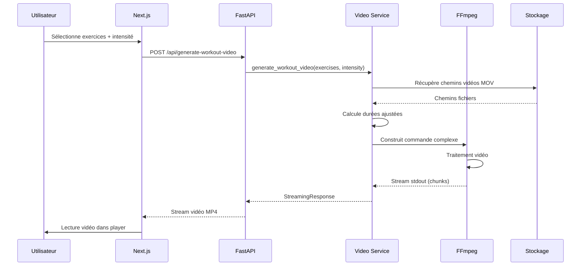

# Plan détaillé du module backend de génération vidéo à la volée

## Objectif
Permettre la génération à la volée d'une vidéo unique en streaming, combinant plusieurs vidéos unitaires MOV avec transparence, avec découpage, modification de vitesse, et overlay d'éléments visuels (timer, barre de progression, nom, description).

## Stack technique choisie : Python + FastAPI + FFmpeg

**Pourquoi Python plutôt que Node.js ?**
- Cohérence avec le code existant ([`png_to_mov.py`](exercices_generation/tools/png_to_mov.py:1))
- Meilleures bibliothèques pour manipulation vidéo
- Plus robuste pour traitement vidéo intensif
- Voir [`backend_technology_comparison.md`](docs/backend_technology_comparison.md:1) pour l'analyse complète

## Technologies principales
- **Python 3.11+** pour le serveur backend
- **FastAPI** pour l'API REST et le streaming HTTP
- **ffmpeg-python** pour l'orchestration FFmpeg
- **FFmpeg** pour le traitement vidéo (concaténation, découpage, vitesse, overlay)
- **Streaming HTTP** via StreamingResponse de FastAPI
- **Stockage** : Supabase Storage (gratuit 1GB) ou local au départ

## Architecture détaillée

```
┌─────────────────────────────────────────────────────────────┐
│                     Next.js Frontend                         │
│  - Sélection exercices + intensité                          │
│  - Player vidéo (React Player ou Video.js)                  │
│  - Deployed on Vercel Free Tier                             │
└──────────────────────┬──────────────────────────────────────┘
                       │ HTTP/REST API
                       ▼
┌─────────────────────────────────────────────────────────────┐
│                 FastAPI Backend (Python)                     │
│                                                              │
│  ┌────────────────────────────────────────────────────┐    │
│  │         API Endpoints (main.py)                     │    │
│  │  - POST /api/generate-workout-video                 │    │
│  │  - GET  /api/exercises                              │    │
│  │  - GET  /api/exercises/{id}                         │    │
│  └────────────────┬───────────────────────────────────┘    │
│                   │                                          │
│  ┌────────────────▼───────────────────────────────────┐    │
│  │      Video Processing Service (video_service.py)    │    │
│  │  - build_ffmpeg_command()                           │    │
│  │  - stream_video()                                   │    │
│  │  - apply_trimming()                                 │    │
│  │  - apply_speed_adjustment()                         │    │
│  │  - add_overlays()                                   │    │
│  └────────────────┬───────────────────────────────────┘    │
│                   │                                          │
│  ┌────────────────▼───────────────────────────────────┐    │
│  │       FFmpeg Wrapper (ffmpeg_utils.py)              │    │
│  │  - Utilise ffmpeg-python                            │    │
│  │  - Gestion des filtres complexes                    │    │
│  │  - Streaming vers stdout                            │    │
│  └────────────────┬───────────────────────────────────┘    │
│                   │                                          │
└───────────────────┼──────────────────────────────────────────┘
                    │
                    ▼
         ┌──────────────────────┐
         │   FFmpeg Process     │
         │   (System binary)    │
         └──────────┬───────────┘
                    │
                    ▼
         ┌──────────────────────┐
         │  Stockage Vidéos     │
         │  - Local ou Supabase │
         │  - Fichiers MOV      │
         │  - Codec: qtrle      │
         │  - Format: ARGB      │
         └──────────────────────┘
```

## Composants détaillés

### 1. Modèle de données (models.py)

```python
class Exercise:
    id: str
    name: str
    description: str
    video_path: str
    duration: float  # en secondes
    default_speed: float  # 1.0 = vitesse normale

class IntensityLevel:
    name: str  # "facile", "moyen", "intense"
    speed_multiplier: float  # 0.8, 1.0, 1.2
    duration_multiplier: float  # 0.7, 1.0, 1.0

class WorkoutSession:
    exercises: List[Exercise]
    intensity: IntensityLevel
    total_duration: float
```

### 2. Service de traitement vidéo (video_service.py)

**Fonctions principales :**

```python
def build_ffmpeg_command(
    exercises: List[Exercise],
    intensity: IntensityLevel
) -> ffmpeg.Stream:
    """
    Construit la commande FFmpeg pour :
    - Concaténer les vidéos
    - Appliquer vitesse selon intensité
    - Découper selon durée souhaitée
    - Ajouter overlays (timer, barre progression, texte)
    """

def add_timer_overlay(stream: ffmpeg.Stream, position: str) -> ffmpeg.Stream:
    """Ajoute un timer sur la vidéo"""

def add_progress_bar(stream: ffmpeg.Stream, total_duration: float) -> ffmpeg.Stream:
    """Ajoute une barre de progression"""

def add_exercise_info(stream: ffmpeg.Stream, exercise: Exercise) -> ffmpeg.Stream:
    """Ajoute nom et description de l'exercice"""

async def stream_video_response(ffmpeg_process) -> StreamingResponse:
    """Retourne la vidéo en streaming HTTP"""
```

### 3. API Endpoints (main.py)

```python
@app.post("/api/generate-workout-video")
async def generate_workout_video(request: WorkoutRequest):
    """
    Génère et stream la vidéo de séance à la volée
    Input: Liste d'exercices + intensité
    Output: StreamingResponse (video/mp4)
    """

@app.get("/api/exercises")
async def list_exercises():
    """Liste tous les exercices disponibles"""

@app.get("/api/exercises/{exercise_id}")
async def get_exercise(exercise_id: str):
    """Détails d'un exercice spécifique"""
```

### 4. Gestion FFmpeg (ffmpeg_utils.py)

**Exemple de commande FFmpeg complexe :**

```python
# Pseudo-code de la construction FFmpeg
input1 = ffmpeg.input('exercise1.mov')
input2 = ffmpeg.input('exercise2.mov')

# Appliquer vitesse
input1_speed = input1.setpts('0.8*PTS')  # ralenti
input2_speed = input2.setpts('1.2*PTS')  # accéléré

# Concaténer
concat = ffmpeg.concat(input1_speed, input2_speed)

# Ajouter overlay timer
timer_overlay = ffmpeg.drawtext(
    concat,
    text='%{pts\:hms}',
    fontsize=30,
    x=10, y=10
)

# Ajouter barre de progression
progress_bar = ffmpeg.drawbox(
    timer_overlay,
    x=0, y='h-20',
    w='w*t/duration', h=20,
    color='blue'
)

# Stream vers stdout
output = progress_bar.output('pipe:', format='mp4', movflags='frag_keyframe+empty_moov')
```

## Flux de données détaillé



## Exemple de requête/réponse API

**Requête :**
```json
POST /api/generate-workout-video
{
  "exercises": [
    {
      "id": "pushups",
      "duration": 30
    },
    {
      "id": "air_squat",
      "duration": 45
    }
  ],
  "intensity": "moyen",
  "show_timer": true,
  "show_progress_bar": true,
  "show_exercise_name": true
}
```

**Réponse :**
```
Status: 200 OK
Content-Type: video/mp4
Transfer-Encoding: chunked

[Binary video data streamed...]
```

## Optimisations pour streaming temps réel

1. **Format MP4 fragmenté** : `movflags='frag_keyframe+empty_moov'`
   - Permet streaming avant fin encodage
   - Pas besoin de connaître durée totale à l'avance

2. **Codec H.264** en sortie pour compatibilité navigateurs

3. **Preset FFmpeg rapide** : `-preset ultrafast` pour latence minimale

4. **Buffer chunks** : Envoyer par morceaux de 64KB

## Gestion des erreurs

- **Vidéo manquante** : Retourner 404 avec message clair
- **FFmpeg crash** : Logs détaillés + fallback vidéo d'erreur
- **Timeout** : Limite de 5 min de génération max
- **Mémoire** : Limite à 2GB par processus

## Stockage des vidéos unitaires

**Phase MVP (local) :**
- Dossier : `exercices_generation/outputs/`
- Accès direct par chemin fichier

**Phase production :**
- Supabase Storage (1GB gratuit, 100GB avec Pro 25€/mois)
- CDN intégré pour delivery optimale
- URLs signées pour sécurité
- Alternative : Backblaze B2 pour volumes importants

## Évolutivité

### Court terme (0-100 utilisateurs)
- Déploiement : Railway/Render Free Tier
- 1 instance backend suffit
- Traitement séquentiel

### Moyen terme (100-1000 utilisateurs)
- Déploiement : Railway/Render Hobby (~10€/mois)
- 2-3 instances avec load balancer
- File d'attente Redis pour jobs

### Long terme (1000+ utilisateurs)
- Microservices : API séparée du processing
- Queue jobs avec Celery
- Workers dédiés pour génération vidéo
- CDN pour vidéos générées fréquemment
- Cache Redis pour configurations populaires

## Sécurité

- Rate limiting : 10 requêtes/min par IP
- Validation stricte des inputs
- Sanitization des noms de fichiers
- Timeout processus FFmpeg
- Limite taille fichiers vidéo

## Monitoring

- Logs structurés (JSON)
- Métriques : durée génération, taux erreur, mémoire
- Alertes si >50% erreurs ou latence >30s

## Prochaines étapes

1. Créer structure projet backend Python
2. Implémenter endpoint basique de streaming
3. Tester concaténation 2 vidéos MOV
4. Ajouter overlays simples (timer)
5. Intégrer avec frontend Next.js
6. Déployer MVP sur Railway
