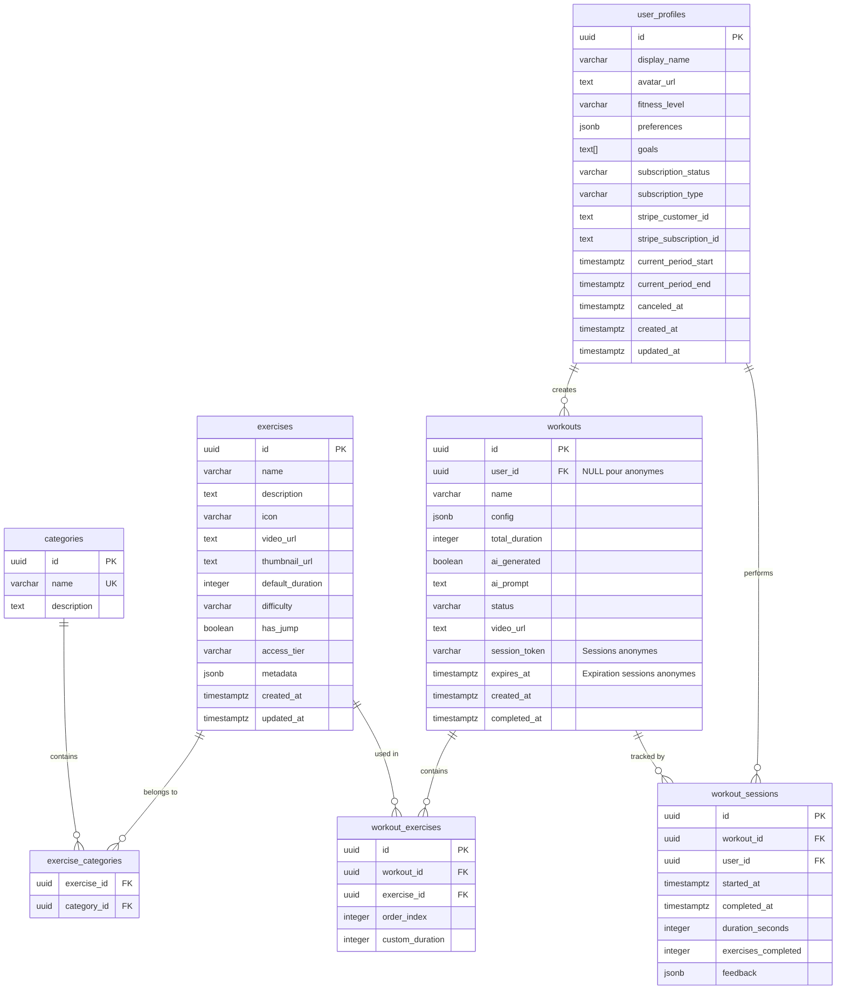

# Schéma de Base de Données - Virtual AI Coach

## Diagramme ER (Entity-Relationship)



## Tables détaillées

### 🏃 **exercises** - Catalogue d'exercices
```sql
CREATE TABLE exercises (
    id UUID PRIMARY KEY DEFAULT gen_random_uuid(),
    name VARCHAR(100) NOT NULL,                    -- "Push-ups", "Air Squat"
    description TEXT,                              -- Instructions détaillées
    icon VARCHAR(50),                              -- "💪" ou "push-ups-icon"
    video_url TEXT NOT NULL,                       -- Supabase Storage URL
    thumbnail_url TEXT,                            -- Preview image
    default_duration INTEGER NOT NULL,             -- 30 secondes
    difficulty VARCHAR(20) CHECK (difficulty IN ('easy', 'medium', 'hard')),
    has_jump BOOLEAN DEFAULT false,                -- Pour filtre "no jump"

    -- 🆕 GESTION FREEMIUM
    access_tier VARCHAR(20) DEFAULT 'free' CHECK (access_tier IN ('free', 'premium')),

    metadata JSONB,                                -- Voir exemple ci-dessous
    created_at TIMESTAMPTZ DEFAULT now(),
    updated_at TIMESTAMPTZ DEFAULT now()
);
```

**Exemple metadata JSONB :**
```json
{
  "muscles_targeted": ["quadriceps", "glutes", "core"],
  "equipment_needed": [],
  "calories_per_min": 8.5,
  "alternative_exercises": ["uuid1", "uuid2"]
}
```

### 🏷️ **categories** - Catégories d'exercices
```sql
CREATE TABLE categories (
    id UUID PRIMARY KEY DEFAULT gen_random_uuid(),
    name VARCHAR(50) UNIQUE NOT NULL,              -- "cardio", "strength", "flexibility"
    description TEXT
);
```

### 🔗 **exercise_categories** - Relation many-to-many
```sql
CREATE TABLE exercise_categories (
    exercise_id UUID REFERENCES exercises(id) ON DELETE CASCADE,
    category_id UUID REFERENCES categories(id) ON DELETE CASCADE,
    PRIMARY KEY (exercise_id, category_id)
);
```

### 🎯 **workouts** - Séances d'entraînement
```sql
CREATE TABLE workouts (
    id UUID PRIMARY KEY DEFAULT gen_random_uuid(),
    user_id UUID,                                  -- NULL pour utilisateurs anonymes
    name VARCHAR(100),                             -- "Ma séance cardio"
    config JSONB NOT NULL,                         -- Configuration complète
    total_duration INTEGER,                        -- Calculé en secondes
    ai_generated BOOLEAN DEFAULT false,            -- Généré par IA ou manuel
    ai_prompt TEXT,                                -- "Je veux une séance cardio intense"
    status VARCHAR(20) DEFAULT 'draft' CHECK (status IN ('draft', 'ready', 'in_progress', 'completed')),
    video_url TEXT,                                -- URL si pré-rendu

    -- 🆕 GESTION SESSIONS ANONYMES
    session_token VARCHAR(255),                    -- Token pour retrouver séances anonymes
    expires_at TIMESTAMPTZ,                        -- Expiration session anonyme (24h)

    created_at TIMESTAMPTZ DEFAULT now(),
    completed_at TIMESTAMPTZ
);
```

**Exemple config JSONB :**
```json
{
  "intensity": "medium_intensity",
  "intervals": {
    "work_time": 40,
    "rest_time": 20
  },
  "no_repeat": false,
  "no_jump": false,
  "intensity_levels": ["easy", "medium", "hard"],
  "include_warm_up": true,
  "include_cool_down": true,
  "target_duration": 30,
  "show_timer": true,
  "show_progress_bar": true,
  "show_exercise_name": true
}
```

### 📋 **workout_exercises** - Exercices dans une séance
```sql
CREATE TABLE workout_exercises (
    id UUID PRIMARY KEY DEFAULT gen_random_uuid(),
    workout_id UUID REFERENCES workouts(id) ON DELETE CASCADE,
    exercise_id UUID REFERENCES exercises(id) ON DELETE RESTRICT,
    order_index INTEGER NOT NULL,                  -- 0, 1, 2... pour l'ordre
    custom_duration INTEGER,                       -- Override si différent du default
    UNIQUE(workout_id, order_index)                -- Un seul exercice par position
);
```

### 👤 **user_profiles** - Profils utilisateurs (Phase 2)
```sql
-- Note: Supabase gère auth.users, on étend juste le profil
CREATE TABLE user_profiles (
    id UUID PRIMARY KEY REFERENCES auth.users(id) ON DELETE CASCADE,
    display_name VARCHAR(100),
    avatar_url TEXT,
    fitness_level VARCHAR(20) CHECK (fitness_level IN ('beginner', 'intermediate', 'advanced')),
    preferences JSONB,                             -- Voir exemple ci-dessous
    goals TEXT[],                                  -- {"lose_weight", "build_muscle"}

    -- 🆕 GESTION ABONNEMENTS STRIPE
    subscription_status VARCHAR(20) DEFAULT 'free' CHECK (subscription_status IN ('free', 'active', 'canceled', 'past_due', 'incomplete')),
    subscription_type VARCHAR(50),                 -- 'basic', 'premium', 'pro'
    stripe_customer_id TEXT UNIQUE,
    stripe_subscription_id TEXT,
    current_period_start TIMESTAMPTZ,
    current_period_end TIMESTAMPTZ,
    canceled_at TIMESTAMPTZ,

    created_at TIMESTAMPTZ DEFAULT now(),
    updated_at TIMESTAMPTZ DEFAULT now()
);
```

**Exemple preferences JSONB :**
```json
{
  "favorite_exercises": ["uuid1", "uuid2"],
  "excluded_exercises": ["uuid3"],
  "preferred_intensity": "medium_intensity",
  "typical_duration_min": 30,
  "training_days": ["monday", "wednesday", "friday"]
}
```

### 📊 **workout_sessions** - Historique d'activité (Phase 2)
```sql
CREATE TABLE workout_sessions (
    id UUID PRIMARY KEY DEFAULT gen_random_uuid(),
    workout_id UUID REFERENCES workouts(id),
    user_id UUID REFERENCES auth.users(id),
    started_at TIMESTAMPTZ DEFAULT now(),
    completed_at TIMESTAMPTZ,
    duration_seconds INTEGER,                      -- Temps réel passé
    exercises_completed INTEGER,                   -- Nb exercices terminés
    feedback JSONB                                 -- Retour utilisateur
);
```

**Exemple feedback JSONB :**
```json
{
  "difficulty": "too_easy",
  "enjoyed": true,
  "would_repeat": true,
  "rating": 4,
  "comments": "Très bien pour commencer"
}
```

## Index de performance

```sql
-- Exercices (lectures fréquentes)
CREATE INDEX idx_exercises_difficulty ON exercises(difficulty);
CREATE INDEX idx_exercises_access_tier ON exercises(access_tier);
CREATE INDEX idx_exercises_metadata ON exercises USING gin(metadata);

-- Workouts (queries utilisateur + sessions anonymes)
CREATE INDEX idx_workouts_user_id ON workouts(user_id);
CREATE INDEX idx_workouts_session_token ON workouts(session_token);
CREATE INDEX idx_workouts_expires_at ON workouts(expires_at);
CREATE INDEX idx_workouts_status ON workouts(status);
CREATE INDEX idx_workouts_created_at ON workouts(created_at DESC);

-- Workout exercises (jointures fréquentes)
CREATE INDEX idx_workout_exercises_workout ON workout_exercises(workout_id);
CREATE INDEX idx_workout_exercises_exercise ON workout_exercises(exercise_id);

-- Sessions (historique)
CREATE INDEX idx_workout_sessions_user ON workout_sessions(user_id);
CREATE INDEX idx_workout_sessions_workout ON workout_sessions(workout_id);

-- User profiles (Stripe)
CREATE INDEX idx_user_profiles_stripe_customer ON user_profiles(stripe_customer_id);
CREATE INDEX idx_user_profiles_subscription_status ON user_profiles(subscription_status);
```

## Données d'exemple

### Exercices de base (Freemium)
```sql
INSERT INTO categories (name, description) VALUES
('cardio', 'Exercices cardiovasculaires'),
('strength', 'Renforcement musculaire'),
('flexibility', 'Étirements et mobilité');

-- 🆓 EXERCICES GRATUITS (4-5 exercices)
INSERT INTO exercises (name, description, icon, video_url, default_duration, difficulty, has_jump, access_tier, metadata) VALUES
(
    'Push-ups',
    'Pompes classiques, gardez le corps aligné, descendez jusqu''à ce que la poitrine touche presque le sol.',
    '💪',
    'https://your-supabase.co/storage/v1/object/public/videos/pushups.mov',
    30,
    'medium',
    false,
    'free',
    '{"muscles_targeted": ["chest", "triceps", "shoulders"], "equipment_needed": [], "calories_per_min": 7.0}'
),
(
    'Air Squat',
    'Squats au poids du corps, pieds écartés largeur d''épaules, descendez comme si vous vous asseyez dans une chaise.',
    '🦵',
    'https://your-supabase.co/storage/v1/object/public/videos/air_squat.mov',
    45,
    'easy',
    false,
    'free',
    '{"muscles_targeted": ["quadriceps", "glutes", "core"], "equipment_needed": [], "calories_per_min": 6.5}'
),
(
    'Plank',
    'Gainage ventral, maintenez la position en gardant le corps aligné.',
    '🏋️',
    'https://your-supabase.co/storage/v1/object/public/videos/plank.mov',
    60,
    'medium',
    false,
    'free',
    '{"muscles_targeted": ["core", "shoulders"], "equipment_needed": [], "calories_per_min": 5.0}'
),
(
    'Jumping Jacks',
    'Écarts sautés, sautez en écartant pieds et bras simultanément.',
    '🤸',
    'https://your-supabase.co/storage/v1/object/public/videos/jumping_jacks.mov',
    30,
    'easy',
    true,
    'free',
    '{"muscles_targeted": ["full_body"], "equipment_needed": [], "calories_per_min": 8.0}'
);

-- 💎 EXERCICES PREMIUM
INSERT INTO exercises (name, description, icon, video_url, default_duration, difficulty, has_jump, access_tier, metadata) VALUES
(
    'Burpees',
    'Mouvement complet : squat, planche, pompe, saut. Exercice très intense.',
    '🔥',
    'https://your-supabase.co/storage/v1/object/public/videos/burpees.mov',
    20,
    'hard',
    true,
    'premium',
    '{"muscles_targeted": ["full_body"], "equipment_needed": [], "calories_per_min": 12.0}'
),
(
    'Mountain Climbers',
    'Grimpeurs, alternez rapidement les genoux vers la poitrine en position planche.',
    '⛰️',
    'https://your-supabase.co/storage/v1/object/public/videos/mountain_climbers.mov',
    30,
    'hard',
    false,
    'premium',
    '{"muscles_targeted": ["core", "shoulders", "legs"], "equipment_needed": [], "calories_per_min": 10.0}'
);
```

### Séance d'exemple (anonyme)
```sql
-- Créer une séance anonyme
INSERT INTO workouts (name, config, total_duration, ai_generated, session_token, expires_at) VALUES
(
    'Séance Découverte',
    '{
        "intensity": "low_impact",
        "intervals": {"work_time": 30, "rest_time": 30},
        "no_repeat": false,
        "no_jump": true,
        "intensity_levels": ["easy", "medium"],
        "include_warm_up": true,
        "include_cool_down": true,
        "target_duration": 10
    }',
    600,
    false,
    'anon_token_abc123xyz',
    NOW() + INTERVAL '24 hours'
);

-- Ajouter exercices gratuits seulement
INSERT INTO workout_exercises (workout_id, exercise_id, order_index, custom_duration)
SELECT
    (SELECT id FROM workouts WHERE session_token = 'anon_token_abc123xyz'),
    e.id,
    ROW_NUMBER() OVER() - 1,
    e.default_duration
FROM exercises e
WHERE e.access_tier = 'free' AND e.name IN ('Push-ups', 'Air Squat', 'Plank')
ORDER BY e.name;
```

## Queries fréquentes

### 1. Lister exercices selon accès utilisateur
```sql
-- Utilisateur anonyme (gratuit seulement)
SELECT e.*, array_agg(c.name) as categories
FROM exercises e
LEFT JOIN exercise_categories ec ON e.id = ec.exercise_id
LEFT JOIN categories c ON ec.category_id = c.id
WHERE e.access_tier = 'free'
GROUP BY e.id
ORDER BY e.name;

-- Utilisateur premium (tous)
SELECT e.*, array_agg(c.name) as categories
FROM exercises e
LEFT JOIN exercise_categories ec ON e.id = ec.exercise_id
LEFT JOIN categories c ON ec.category_id = c.id
GROUP BY e.id
ORDER BY e.name;
```

### 2. Récupérer séance complète avec nombre d'exercices
```sql
SELECT
    w.*,
    COUNT(we.exercise_id) as exercise_count,       -- Calculé dynamiquement (plus de champ rounds)
    json_agg(
        json_build_object(
            'exercise', row_to_json(e.*),
            'order', we.order_index,
            'custom_duration', we.custom_duration
        ) ORDER BY we.order_index
    ) as exercises
FROM workouts w
LEFT JOIN workout_exercises we ON w.id = we.workout_id
LEFT JOIN exercises e ON we.exercise_id = e.id
WHERE w.id = $1
GROUP BY w.id;
```

### 3. Récupérer séance anonyme avec token
```sql
SELECT
    w.*,
    COUNT(we.exercise_id) as exercise_count,
    json_agg(
        json_build_object(
            'exercise', row_to_json(e.*),
            'order', we.order_index,
            'custom_duration', we.custom_duration
        ) ORDER BY we.order_index
    ) as exercises
FROM workouts w
LEFT JOIN workout_exercises we ON w.id = we.workout_id
LEFT JOIN exercises e ON we.exercise_id = e.id
WHERE w.session_token = $1 AND w.expires_at > NOW()
GROUP BY w.id;
```

### 4. Vérification accès exercice selon abonnement
```sql
-- Vérifier si utilisateur peut utiliser un exercice
SELECT
    e.access_tier,
    CASE
        WHEN e.access_tier = 'free' THEN true
        WHEN u.subscription_status = 'active' THEN true
        ELSE false
    END as has_access
FROM exercises e
LEFT JOIN user_profiles u ON u.id = $2  -- user_id (NULL si anonyme)
WHERE e.id = $1;  -- exercise_id
```

### 5. Nettoyage sessions expirées
```sql
-- Supprimer séances anonymes expirées (tâche cron)
DELETE FROM workouts
WHERE user_id IS NULL
  AND expires_at < NOW();
```

## Évolution du schéma

### Phase 1 (MVP) - Mode Freemium
- ✅ exercises avec access_tier (free/premium)
- ✅ categories, exercise_categories
- ✅ workouts avec session_token pour anonymes
- ✅ workout_exercises
- ❌ Pas d'auth utilisateur obligatoire

### Phase 2 (Growth) - Abonnements
- ✅ user_profiles avec gestion Stripe
- ✅ workout_sessions (tracking)
- ✅ Migration séances anonymes vers comptes
- ✅ Webhook Stripe pour mise à jour abonnements

### Phase 3 (Scale) - Fonctionnalités avancées
- 🔄 workout_templates (séances pré-faites)
- 🔄 user_favorites (exercices favoris)
- 🔄 social_features (partage séances)
- 🔄 analytics (métriques avancées)

## Gestion des sessions anonymes

### Création session anonyme
```python
# Backend - Génération token et expiration
import secrets
from datetime import datetime, timedelta

session_token = secrets.token_urlsafe(32)
expires_at = datetime.now() + timedelta(hours=24)
```

### Migration vers compte premium
```sql
-- Récupérer séances anonymes d'un utilisateur qui s'inscrit
UPDATE workouts
SET user_id = $1, session_token = NULL, expires_at = NULL
WHERE session_token = $2 AND expires_at > NOW();
```

### Nettoyage automatique
```python
# Tâche cron pour supprimer séances expirées
@scheduler.scheduled_job('cron', hour=2)  # Tous les jours à 2h
async def cleanup_expired_workouts():
    await supabase.table('workouts').delete().lt('expires_at', datetime.now()).is_('user_id', 'null').execute()
```

Ce schéma supporte parfaitement le modèle freemium avec mode anonyme et évolution vers abonnements payants !
