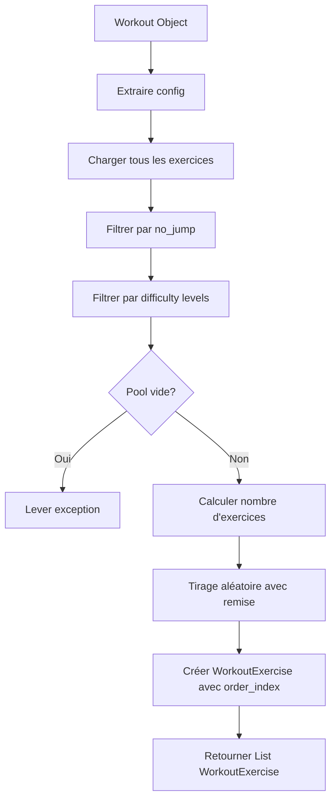
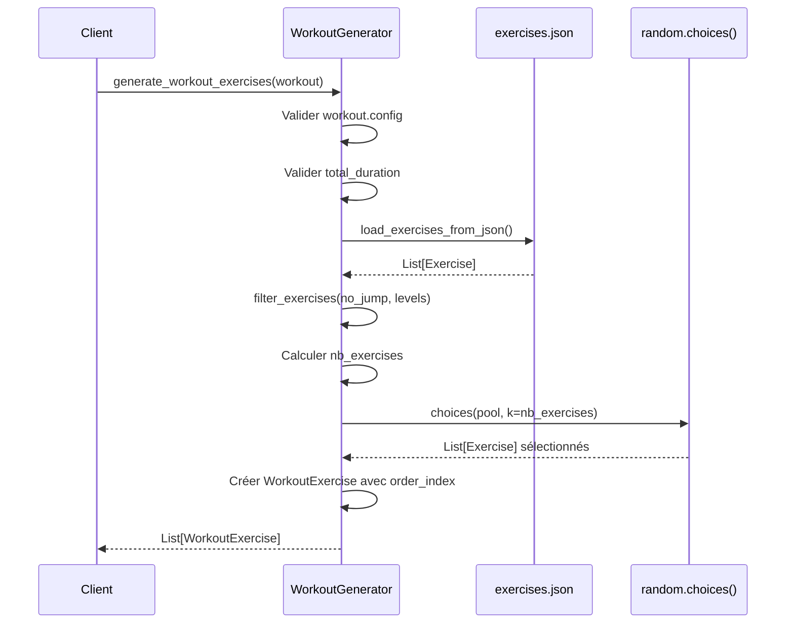

# Plan Architectural : Générateur d'Exercices pour Workout

## Vue d'ensemble

Ce document décrit l'architecture et l'implémentation d'une fonction de génération d'exercices aléatoires pour les séances d'entraînement (Workout). La fonction sélectionne et tire aléatoirement des exercices selon les critères de configuration définis dans un objet [`Workout`](../backend/app/models/workout.py).

## Contexte

### Besoin
Générer automatiquement une liste d'exercices pour un workout en fonction de :
- La durée totale de la séance (`total_duration` en secondes)
- Les préférences de configuration (`WorkoutConfig`)
- Les critères de filtrage : `no_jump`, `exercice_intensity_levels`, `intervals`

### Principe de calcul
- **1 interval = 1 exercice**
- **1 interval ≈ 1 minute** (work_time + rest_time)
- **Nombre d'exercices = total_duration / 60** (en minutes)
- **Tirage aléatoire avec remise** : un même exercice peut apparaître plusieurs fois

## Architecture de la Solution

### Localisation
Le code sera implémenté dans : `backend/app/services/workout_generator.py`

### Dépendances
```python
from typing import List
from pathlib import Path
import json
import random

from ..models.workout import Workout, WorkoutExercise
from ..models.exercise import Exercise, Difficulty
```

## Flux de Données



## Structure du Code

### 1. Fonction de chargement des exercices
```python
def load_exercises_from_json() -> List[Exercise]:
    """
    Charge tous les exercices depuis exercises.json

    Returns:
        List[Exercise]: Liste complète des exercices validés

    Raises:
        FileNotFoundError: Si exercises.json n'existe pas
        ValueError: Si le JSON est invalide
    """
```

**Détails d'implémentation :**
- Réutiliser la logique de [`api/exercises.py:load_exercises()`](../backend/app/api/exercises.py:17)
- Utiliser `Path` pour résoudre le chemin du fichier
- Valider avec Pydantic lors de la désérialisation

### 2. Fonction de filtrage
```python
def filter_exercises(
    exercises: List[Exercise],
    no_jump: bool,
    intensity_levels: List[Difficulty]
) -> List[Exercise]:
    """
    Filtre les exercices selon les critères de configuration

    Args:
        exercises: Liste complète des exercices
        no_jump: Si True, exclut les exercices avec has_jump=True
        intensity_levels: Niveaux de difficulté acceptés

    Returns:
        List[Exercise]: Exercices filtrés

    Raises:
        ValueError: Si aucun exercice ne correspond aux critères
    """
```

**Logique de filtrage :**
1. **Filtrage par sauts :**
   - Si `no_jump = True` → garder seulement `exercise.has_jump == False`
   - Si `no_jump = False` → garder tous les exercices

2. **Filtrage par difficulté :**
   - Garder seulement les exercices dont `exercise.difficulty in intensity_levels`

3. **Validation :**
   - Vérifier que le pool résultant n'est pas vide
   - Lever une exception explicite si aucun exercice ne correspond

### 3. Fonction de génération aléatoire
```python
def generate_random_exercises(
    exercises_pool: List[Exercise],
    count: int
) -> List[Exercise]:
    """
    Tire aléatoirement avec remise des exercices

    Args:
        exercises_pool: Pool d'exercices éligibles
        count: Nombre d'exercices à tirer

    Returns:
        List[Exercise]: Exercices sélectionnés (peut contenir des doublons)

    Note:
        Utilise random.choices() pour tirage avec remise
    """
```

**Détails d'implémentation :**
- Utiliser `random.choices(exercises_pool, k=count)` pour tirage avec remise
- Permet la répétition d'exercices (important pour diversité limitée)

### 4. Fonction principale
```python
def generate_workout_exercises(workout: Workout) -> List[WorkoutExercise]:
    """
    Génère la liste complète des exercices pour un workout

    Args:
        workout: Objet Workout avec config et total_duration

    Returns:
        List[WorkoutExercise]: Exercices ordonnés pour le workout

    Raises:
        ValueError: Si config manquante ou critères trop restrictifs

    Example:
        >>> workout = Workout(
        ...     total_duration=600,  # 10 minutes
        ...     config=WorkoutConfig(
        ...         no_jump=True,
        ...         exercice_intensity_levels=[Difficulty.EASY, Difficulty.MEDIUM]
        ...     )
        ... )
        >>> exercises = generate_workout_exercises(workout)
        >>> len(exercises)
        10
    """
```

**Algorithme complet :**

```python
def generate_workout_exercises(workout: Workout) -> List[WorkoutExercise]:
    # 1. Validation des entrées
    if not workout.config:
        raise ValueError("Workout doit avoir une config")

    if not workout.total_duration or workout.total_duration <= 0:
        raise ValueError("total_duration doit être positif")

    # 2. Charger tous les exercices
    all_exercises = load_exercises_from_json()

    # 3. Filtrer selon les critères
    filtered_exercises = filter_exercises(
        exercises=all_exercises,
        no_jump=workout.config.no_jump,
        intensity_levels=workout.config.exercice_intensity_levels
    )

    # 4. Calculer le nombre d'exercices nécessaires
    # 1 exercice par minute (intervals de ~60s)
    num_exercises = workout.total_duration // 60

    # 5. Tirer aléatoirement avec remise
    selected_exercises = generate_random_exercises(
        exercises_pool=filtered_exercises,
        count=num_exercises
    )

    # 6. Créer les WorkoutExercise avec order_index
    workout_exercises = []
    for index, exercise in enumerate(selected_exercises):
        workout_exercise = WorkoutExercise(
            exercise_id=exercise.id,
            order_index=index,
            custom_duration=None  # Utiliser default_duration de l'exercice
        )
        workout_exercises.append(workout_exercise)

    return workout_exercises
```

## Gestion des Erreurs

### Cas d'erreur à gérer

| Erreur | Cause | Solution |
|--------|-------|----------|
| `ValueError: Config manquante` | `workout.config` est None | Valider avant l'appel |
| `ValueError: Duration invalide` | `total_duration <= 0` | Valider avant l'appel |
| `FileNotFoundError` | exercises.json absent | Message clair pour l'admin |
| `ValueError: Pool vide` | Filtres trop restrictifs | Message explicite à l'utilisateur |
| `JSONDecodeError` | JSON corrompu | Message pour l'admin |

### Messages d'erreur suggérés

```python
# Pool vide après filtrage
raise ValueError(
    f"Aucun exercice trouvé pour les critères : "
    f"no_jump={workout.config.no_jump}, "
    f"difficulty_levels={workout.config.exercice_intensity_levels}"
)

# Total duration invalide
raise ValueError(
    f"total_duration doit être > 0, reçu: {workout.total_duration}"
)
```

## Tests Unitaires

### Fichier de tests : `backend/tests/test_workout_generator.py`

#### Tests à implémenter

1. **Test de chargement des exercices**
   ```python
   def test_load_exercises_from_json_success():
       """Vérifie que les exercices se chargent correctement"""

   def test_load_exercises_json_not_found():
       """Vérifie l'erreur si le fichier n'existe pas"""
   ```

2. **Tests de filtrage**
   ```python
   def test_filter_no_jump():
       """Vérifie que les exercices avec saut sont exclus si no_jump=True"""

   def test_filter_difficulty_levels():
       """Vérifie le filtrage par niveau de difficulté"""

   def test_filter_empty_pool():
       """Vérifie l'exception si aucun exercice ne correspond"""

   def test_filter_no_restrictions():
       """Vérifie que tous les exercices passent sans restrictions"""
   ```

3. **Tests de génération aléatoire**
   ```python
   def test_generate_random_exercises_count():
       """Vérifie que le bon nombre d'exercices est généré"""

   def test_generate_random_exercises_with_replacement():
       """Vérifie que le tirage avec remise fonctionne (doublons possibles)"""
   ```

4. **Tests de la fonction principale**
   ```python
   def test_generate_workout_exercises_success():
       """Test nominal avec config valide"""

   def test_generate_workout_exercises_no_config():
       """Vérifie l'erreur si config manquante"""

   def test_generate_workout_exercises_invalid_duration():
       """Vérifie l'erreur si duration invalide"""

   def test_generate_workout_exercises_order_index():
       """Vérifie que order_index est séquentiel (0, 1, 2...)"""

   def test_generate_workout_exercises_correct_count():
       """Vérifie que nb_exercises = total_duration / 60"""
   ```

5. **Tests d'intégration**
   ```python
   def test_full_workflow_10_minutes():
       """Test complet : 10 min = 10 exercices filtrés correctement"""

   def test_full_workflow_restrictive_filters():
       """Test avec filtres très restrictifs"""
   ```

### Fixtures de test

```python
@pytest.fixture
def sample_workout():
    return Workout(
        total_duration=600,  # 10 minutes
        config=WorkoutConfig(
            no_jump=True,
            exercice_intensity_levels=[Difficulty.EASY, Difficulty.MEDIUM]
        )
    )

@pytest.fixture
def sample_exercises():
    return [
        Exercise(
            id=uuid4(),
            name="Push-ups",
            difficulty=Difficulty.MEDIUM,
            has_jump=False,
            video_url="...",
            default_duration=30
        ),
        # ... autres exercices
    ]
```

## Considérations Futures

### Migration vers Supabase

**TODO pour la migration :**
```python
# TODO: Remplacer load_exercises_from_json() par une requête Supabase
# async def load_exercises_from_db() -> List[Exercise]:
#     """Charge les exercices depuis Supabase"""
#     supabase = get_supabase_client()
#     response = await supabase.table('exercises').select('*').execute()
#     return [Exercise(**ex) for ex in response.data]
```

**Points d'attention :**
- Ajouter le support async/await
- Gérer les erreurs de connexion DB
- Mettre en cache les résultats pour performance
- Ajouter des index sur `has_jump` et `difficulty` dans Supabase

### Optimisations possibles

1. **Cache des exercices**
   - Éviter de recharger le JSON à chaque appel
   - Utiliser `functools.lru_cache` ou cache applicatif

2. **Pondération des exercices**
   - Ajouter des poids pour favoriser certains exercices
   - Utiliser `random.choices(weights=...)` au lieu de distribution uniforme

3. **Diversification**
   - Implémenter `no_repeat` pour éviter les doublons consécutifs
   - Alterner les groupes musculaires

4. **Warm-up et Cool-down**
   - Tenir compte de `include_warm_up` et `include_cool_down`
   - Réserver des slots spécifiques en début/fin

## Diagramme de Séquence



## Exemple d'Utilisation

```python
from backend.app.models.workout import Workout
from backend.app.models.config import WorkoutConfig
from backend.app.models.exercise import Difficulty
from backend.app.services.workout_generator import generate_workout_exercises

# Créer un workout
workout = Workout(
    name="Ma séance du matin",
    total_duration=1200,  # 20 minutes
    config=WorkoutConfig(
        no_jump=True,  # Pas de sauts
        exercice_intensity_levels=[Difficulty.EASY, Difficulty.MEDIUM],
        intervals={"work_time": 40, "rest_time": 20}
    )
)

# Générer les exercices
workout_exercises = generate_workout_exercises(workout)

# Résultat : 20 WorkoutExercise avec order_index de 0 à 19
print(f"Nombre d'exercices générés : {len(workout_exercises)}")  # 20
print(f"Premier exercice : order_index={workout_exercises[0].order_index}")  # 0
print(f"Dernier exercice : order_index={workout_exercises[-1].order_index}")  # 19
```

## Checklist d'Implémentation

- [ ] Créer `backend/app/services/workout_generator.py`
- [ ] Implémenter `load_exercises_from_json()`
- [ ] Implémenter `filter_exercises()`
- [ ] Implémenter `generate_random_exercises()`
- [ ] Implémenter `generate_workout_exercises()` (fonction principale)
- [ ] Ajouter gestion d'erreurs complète
- [ ] Créer `backend/tests/test_workout_generator.py`
- [ ] Écrire tous les tests unitaires
- [ ] Ajouter docstrings détaillées avec exemples
- [ ] Ajouter TODO pour migration Supabase
- [ ] Tester manuellement avec différentes configs
- [ ] Documenter dans le README si nécessaire

## Notes Techniques

### Pourquoi `random.choices()` ?
- **Avec remise** : permet de réutiliser les exercices (important si pool < nb_exercises)
- **Performance** : O(n) pour générer n éléments
- **Simplicité** : une seule ligne de code

### Pourquoi `total_duration // 60` ?
- Division entière pour avoir un nombre exact d'exercices
- 1 interval ≈ 60 secondes (work_time + rest_time)
- Les secondes restantes ne comptent pas comme exercice complet

### Gestion de `exercise.id`
- Les IDs doivent être générés lors du chargement du JSON
- Actuellement le JSON ne contient pas d'ID
- **Action requise** : ajouter génération d'UUID ou utiliser un identifiant stable (ex: hash du nom)

---

**Version** : 1.0
**Date** : 2025-10-30
**Auteur** : Architecture Roo Mode
